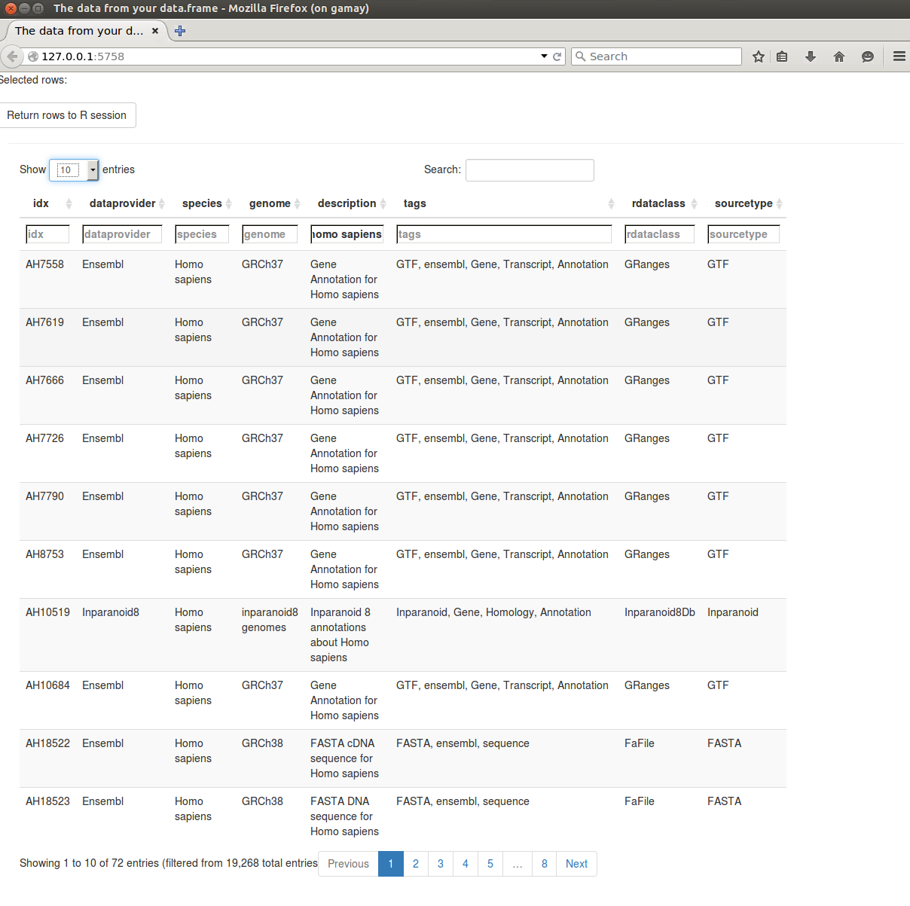

<!--
% \VignetteIndexEntry{AnnotationHub: Access the AnnotationHub Web Service}
% \VignetteDepends{AnnotationHub}
% \VignetteEngine{knitr::knitr}
-->

```{r style, echo = FALSE, results = 'asis'}
BiocStyle::markdown()
```

# AnnotationHub: Access the AnnotationHub Web Service

**Package**: `r Biocpkg("AnnotationHub")`<br />
**Authors**: `r packageDescription("AnnotationHub")[["Author"]] `<br />
**Modified**: 11 October, 2014<br />
**Compiled**: `r date()`

The `AnnotationHub` server provides easy _R / Bioconductor_ access to
large collections of publicly available whole genome resources,
e.g,. ENSEMBL genome fasta or gtf files, UCSC chain resources, ENCODE
data tracks at UCSC, etc.

## AnnotationHub objects

The `r Biocpkg("AnnotationHub")` package provides a client interface
to resources stored at the AnnotationHub web service.

```{r library, message=FALSE}
library(AnnotationHub)
```

The `r Biocpkg("AnnotationHub")` package is straightforward to use.
Create an `AnnotationHub` object

```{r AnnotationHub}
ah = AnnotationHub()
```

Now at this point you have already done everything you need in order
to start retrieving annotations.  For most operations, using the
`AnnotationHub` object should feel a lot like working with a familiar
`list` or `data.frame`. 

Lets take a minute to look at the show method for the hub object ah 

```{r show}
ah
```

From a first glance, you can see that it gives you an idea about the
different types of data that is present inside the hub. You can see 
where the data is coming from 

```{r dataprovider}
unique(ah$dataprovider)
```

You can also see data from different species inside the hub using 

```{r species}
head(unique(ah$species))
```
Now lets try getting the Chain Files from UCSC using the query and subset
 methods to selectively pare down the hub based on specific criteria. 
The query method lets you search rows for
specific strings, returning an `AnnotationHub` instance with just the
rows matching the query.

```{r chain1}
chain <- query(ah, "ChainFile")
chain
```
From the show method, one can easily see that the dataprovider now contains
only UCSC and rdataclass has only ChainFile

One can further subset to get the chain files from Drosophila melanogaster

```{r dm1}
dm <- query(chain, "Drosophila melanogaster")
dm
```
Query has worked and you can now see that the only species present is 
Drosophila melanogaster. 
 
The metadata underlying this hub object can be retrieved by you 

```{r show2}
df <- mcols(dm)
```

By default the show method will only display the first 5 and last 5  rows.
There are already thousands of records present in the hub.

```{r length}
length(ah)
```
Lets look at another example, where we pull down only Inparanoid8 data 
from the hub and use  subset to return a smaller base object (here we
 are finding cases where the genome column is set to panda).

```{r subset}
ahs <- query(ah, 'inparanoid8')
ahs
ahs <- subset(ah, ah$genome=='ailMel1')
ahs
```

We can also look at the `AnnotationHub` object in a browser using the
`display()` function. We can then filter the `AnnotationHub` object
for _Homo sapiens_ by either using the Global search field on the top
right corner of the page or the in-column search field for `Species'.

```{r display, eval=FALSE}
d <- display(ah)
```


Displaying and filtering the Annotation Hub object in a browser

By default 1000 entries are displayed per page, we can change this using
the filter on the top of the page or navigate through different pages
using the page scrolling feature at the bottom of the page.

We can also select the rows of interest to us and send them back to
the R session using 'Send Rows' button ; this sets a filter internally
which filters the `AnnotationHub` object.

## Using `AnnotationHub` to retrieve data

Looking back at our chain file example, if we are interested in the file 
dm1ToDm2.over.chain.gz, we can gets its metadata using

```{r dm2}
dm
dm["AH15146"]
```
We can download the file using

```{r dm3}
dm[["AH15146"]]
```
Each file is retrieved from the AnnotationHub server and the file is
also cache locally, so that the next time you need to retrieve it,
it should download much more quickly.

## Configuring `AnnotationHub` objects

When you create the `AnnotationHub` object, it will set up the object
for you with some default settings.  See `?AnnotationHub` for ways to
customize the hub source, the local cache, and other instance-specific
options, and `?hubOption` to set package-global options for use across
sessions. 

If you look at the object you will see some helpful information about
it such as where the data is cached and where online the hub server is
set to.

```{r show-2}
ah
```

By default the `AnnotationHub` object is set to the latest
`snapshotData` and a snapshot version that matches the version of
_Bioconductor_ that you are using. You can also learn about these data
with the appropriate methods.

```{r snapshot}
snapshotDate(ah)
```

If you are interested in using an older version of a snapshot, you can
list previous versions with the `possibleDates()` like this:

```{r possibleDates}
pd <- possibleDates(ah)
pd
```

Set the dates like this:

```{r setdate, eval=FALSE}
snapshotDate(ah) <- pd[1]
```

# Session info

```{r sessionInfo}
sessionInfo()
```
