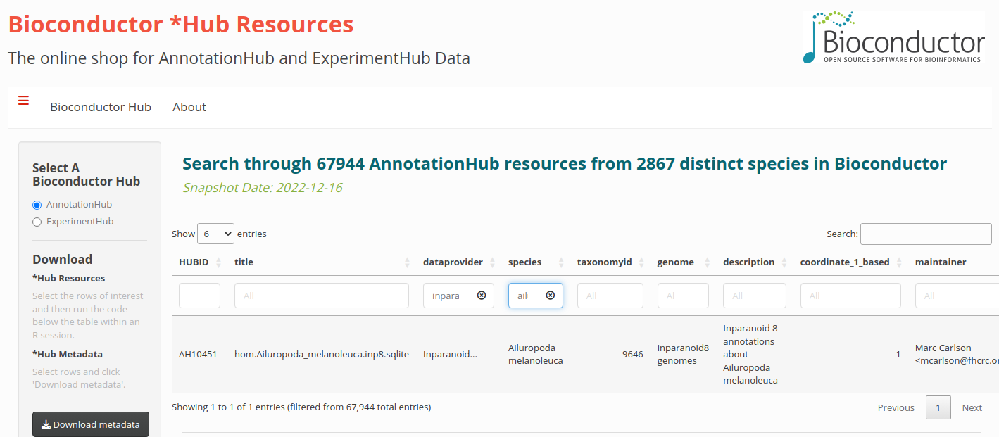

```{r style, echo = FALSE, results = 'asis'}
BiocStyle::markdown()
```
**Package**: `r Biocpkg("AnnotationHub")`<br />
**Authors**: `r packageDescription("AnnotationHub")[["Author"]] `<br />
**Modified**: 27 May, 2016<br />
**Compiled**: `r date()`

The `AnnotationHub` server provides easy _R / Bioconductor_ access to
large collections of publicly available whole genome resources,
e.g,. ENSEMBL genome fasta or gtf files, UCSC chain resources, ENCODE
data tracks at UCSC, etc.

# AnnotationHub objects

The `r Biocpkg("AnnotationHub")` package provides a client interface
to resources stored at the AnnotationHub web service.

```{r library, message=FALSE}
library(AnnotationHub)
```

The `r Biocpkg("AnnotationHub")` package is straightforward to use.
Create an `AnnotationHub` object

```{r AnnotationHub}
ah = AnnotationHub()
```

Now at this point you have already done everything you need in order
to start retrieving annotations.  For most operations, using the
`AnnotationHub` object should feel a lot like working with a familiar
`list` or `data.frame`. 

Lets take a minute to look at the show method for the hub object ah 

```{r show}
ah
```

You can see that it gives you an idea about the different types of data that are present inside the hub. You can see where the data is coming from (dataprovider), as well as what species have samples present (species), what kinds of R data objects could be returned (rdataclass).  We can take a closer look at all the kinds of data providers that are available by simply looking at the contents of dataprovider as if it were the column of a data.frame object like this:

```{r dataprovider}
unique(ah$dataprovider)
```

In the same way, you can also see data from different species inside the hub by looking at the contents of species like this: 

```{r species}
head(unique(ah$species))
```

And this will also work for any of the other types of metadata present.  You can learn which kinds of metadata are available by simply hitting the tab key after you type 'ah$'.  In this way you can explore for yourself what kinds of data are present in the hub right from the command line. This interface also allows you to access the hub programatically to extract data that matches a particular set of criteria.

Another valuable types of metadata to pay attention to is the rdataclass.

```{r rdataclass}
head(unique(ah$rdataclass))
```

The rdataclass allows you to see which kinds of R objects the hub will return to you.  This kind of information is valuable both as a means to filter results and also as a means to explore and learn about some of the kinds of annotation objects that are widely available for the project.  Right now this is a pretty short list, but over time it should grow as we support more of the different kinds of annotation objects via the hub.


Now lets try getting the Chain Files from UCSC using the query and subset methods to selectively pare down the hub based on specific criteria. 
The query method lets you search rows for
specific strings, returning an `AnnotationHub` instance with just the
rows matching the query.

From the show method, one can easily see that one of the dataprovider is
UCSC and there is a rdataclass for ChainFile

One can get chain files for Drosophila melanogaster from UCSC with:

```{r dm1}
dm <- query(ah, c("ChainFile", "UCSC", "Drosophila melanogaster"))
dm
```
Query has worked and you can now see that the only species present is 
Drosophila melanogaster. 
 
The metadata underlying this hub object can be retrieved by you 

```{r show2}
df <- mcols(dm)
```

By default the show method will only display the first 5 and last 5  rows.
There are already thousands of records present in the hub.

```{r length}
length(ah)
```
Lets look at another example, where we pull down only Inparanoid8 data 
from the hub and use  subset to return a smaller base object (here we
 are finding cases where the genome column is set to panda).

```{r subset}
ahs <- query(ah, c('inparanoid8', 'ailuropoda'))
ahs
```

We can perform the same query using the `BiocHubsShiny()` function from the
eponymous package. In the 'dataprovider' field we enter `inparanoid8` and
`ailuropoda` in the species field.

```{r interactiveDisplay, eval=FALSE}
BiocHubsShiny::BiocHubsShiny()
```

```{r,echo=FALSE,fig.cap="BiocHubsShiny query with terms dataprovider = 'inparanoid' and species = 'ailuropoda'"}

```

By default 6 entries are displayed per page, we can change this using
the drop down menu at the top of the table. We can also navigate through
different pages using the page scrolling feature at the bottom right of the
table.

We can select the rows of interest and send the metadata back to
the R session using the 'Send metadata' button. The resource identifiers
are located in the "HUBID" column of the metadata table (`ah_meta`) returned.

# Using `AnnotationHub` to retrieve data

Looking back at our chain file example, if we are interested in the file 
dm1ToDm2.over.chain.gz, we can gets its metadata using

```{r dm2}
dm
dm["AH15146"]
```
We can download the file using

```{r dm3}
dm[["AH15146"]]
```
Each file is retrieved from the AnnotationHub server and the file is
also cache locally, so that the next time you need to retrieve it,
it should download much more quickly.

# Configuring `AnnotationHub` objects

When you create the `AnnotationHub` object, it will set up the object
for you with some default settings.  See `?AnnotationHub` for ways to
customize the hub source, the local cache, and other instance-specific
options, and `?getAnnotationHubOption` to get or set package-global 
options for use across sessions. 

If you look at the object you will see some helpful information about
it such as where the data is cached and where online the hub server is
set to.

```{r show-2}
ah
```

By default the `AnnotationHub` object is set to the latest
`snapshotData` and a snapshot version that matches the version of
_Bioconductor_ that you are using. You can also learn about these data
with the appropriate methods.

```{r snapshot}
snapshotDate(ah)
```

If you are interested in using an older version of a snapshot, you can
list previous versions with the `possibleDates()` like this:

```{r possibleDates}
pd <- possibleDates(ah)
pd
```

Set the dates like this:

```{r setdate, eval=FALSE}
snapshotDate(ah) <- pd[1]
```
# AnnotationHub objects in a cluster environment

Resources in AnnotationHub aren't loaded with the standard `R` package approach
and therefore can't be loaded on cluster nodes with library(). There are a
couple of options to sharing AnnotationHub objects across a cluster when
researchers are using the same R install and want access to the same
annotations.

As an example, we create a TxDb object from a GRanges stored in AnnotationHub
contributed by contributed by Timothée Flutre.  The GRanges was created from a
GFF file and contains gene information for Vitis vinifera.

* Download once and build on the fly

One option is that each user downloads the resource with hub[["AH50773"]] and
the GRanges is saved in the cache. Each subsequent call to 
hub[["AH50773"]] retrieves the resource from the cache which is very fast.

The necessary code extracts the resource then calls makeTxDbFromGRanges().
```{r clusterOptions1, eval=FALSE}
library(AnnotationHub)
hub <- AnnotationHub()
gr <- hub[["AH50773"]]  ## downloaded once
txdb <- makeTxDbFromGRanges(gr)  ## build on the fly
```

* Build once and share

Another approach is that one user builds the TxDb and saves it as a .sqlite
file. The cluster admin installs this in a common place on all cluster nodes
and each user can load it with loadDb(). Loading the file is as quick and
easy as calling library() on a TxDb package.

Once the .sqlite file is install each user's code would include:
```{r clusterOptions2, eval=FALSE}
library(AnnotationDbi)  ## if not already loaded
txdb <- loadDb("/locationToFile/mytxdb.sqlite")
```

# Creating an AnnotationHub Package or Converting to an AnnotationHub Package

Please see `r Biocpkg("HubPub")` Vignette "CreateAHubPackage".
```
vignette("CreateAHubPackage", package="HubPub")
```

# Troubleshooting

Please see AnnotationHub vignette "TroubleshootingTheCache".
```
vignette("TroubleshootingTheCache", package=AnnotationHub)
```


# Session info

```{r sessionInfo}
sessionInfo()
```
